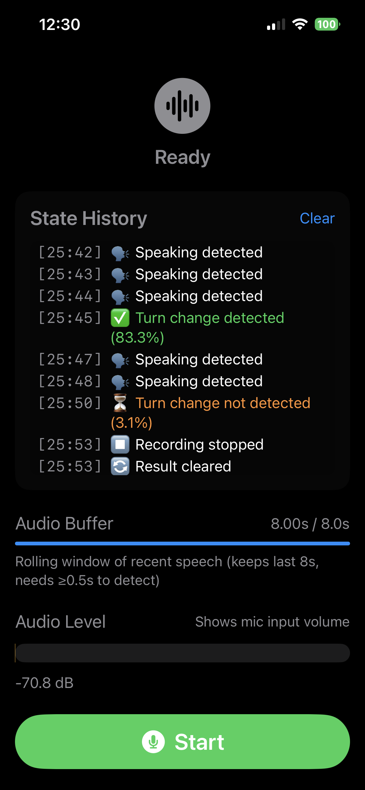

# SmartTurn iOS

Real-time turn detection for conversational AI using audio analysis. Detects when a speaker has finished their turn by analyzing speech patterns and silence periods.



> **Note**: This iOS implementation is based on the [SmartTurn project](https://github.com/pipecat-ai/smart-turn) by Pipecat AI. The ONNX model (`smart-turn-v3.0.onnx`) and core turn detection approach originated from their work.

## Overview

SmartTurn is an iOS application that uses machine learning to detect conversation turn completion in real-time. It analyzes audio input using a Whisper-based feature extractor and an ONNX Runtime model to determine when a speaker has finished speaking.

### Key Features

- **Real-time Audio Processing**: Captures and analyzes audio with 16kHz sampling
- **ML-Powered Detection**: Uses ONNX Runtime with INT8 quantized model for efficient inference
- **Silence-Based Triggering**: Automatically detects turn completion after 1.5 seconds of silence
- **Visual Feedback**: Live audio level visualization and state history logging
- **8-Second Rolling Buffer**: Maintains context of recent speech for accurate detection
- **Low Latency**: Optimized for <12ms inference time on mobile devices

## How It Works

1. **Audio Capture**: Records audio using the device microphone at 16kHz
2. **Feature Extraction**: Converts audio to Whisper-compatible mel-spectrogram features (80 mel bins × 800 frames)
3. **Silence Detection**: Monitors audio levels to detect pauses in speech
4. **ML Inference**: Runs ONNX model to predict turn completion probability
5. **Result Display**: Shows detection results with confidence scores in the UI

## Technical Stack

- **Language**: Swift 5.0
- **ML Runtime**: ONNX Runtime 1.20.0+
- **Audio Processing**: AVFoundation + Accelerate framework
- **UI Framework**: SwiftUI
- **Deployment Target**: iOS 17.0+
- **Model**: Custom turn detection model (`smart-turn-v3.0.onnx`)

## Architecture

```
smart-turn-ios/
├── Audio/
│   ├── AudioCaptureEngine.swift      # Audio capture and buffering
│   └── WhisperFeatureExtractor.swift # Mel-spectrogram feature extraction
├── TurnDetection/
│   └── SmartTurnDetector.swift       # ONNX Runtime inference coordinator
├── Views/
│   └── TurnDetectionView.swift       # Main UI with audio visualization
├── Models/
│   └── smart-turn-v3.0.onnx          # Trained turn detection model
└── ContentView.swift                  # Root view
```

## Setup

### Prerequisites

- Xcode 15.0+
- iOS 17.0+ device or simulator
- ONNX model file (`smart-turn-v3.0.onnx`)

### Installation

1. Clone the repository:
```bash
git clone https://github.com/matthewchung74/smart-turn-ios.git
cd smart-turn-ios
```

2. Open the project in Xcode:
```bash
open smart-turn-ios.xcodeproj
```

3. Ensure the ONNX model is included:
   - The model file `smart-turn-v3.0.onnx` should be in `smart-turn-ios/Models/`
   - Verify it's included in the target's "Copy Bundle Resources" build phase

4. Build and run:
   - Select your target device or simulator
   - Press `Cmd+R` to build and run

### Dependencies

The project uses Swift Package Manager for dependencies:

- **ONNX Runtime** (`microsoft/onnxruntime-swift-package-manager`)
  - Provides ML inference on iOS
  - Version: 1.20.0+
  - Installed automatically by Xcode

## Usage

1. **Grant Microphone Permission**: On first launch, allow microphone access
2. **Start Recording**: Tap the "Start" button to begin audio capture
3. **Speak Naturally**: The app maintains a rolling 8-second buffer of your speech
4. **Pause to Detect**: After speaking, pause for 1.5 seconds to trigger detection
5. **View Results**:
   - **Green**: Turn change detected (probability ≥50%)
   - **Orange**: Turn change not detected (probability <50%)
6. **State History**: Review timestamped log of all detection events

### Detection Parameters

- **Silence Threshold**: 0.005 RMS (configurable in `TurnDetectionView.swift:59`)
- **Silence Duration**: 1.5 seconds (configurable in `TurnDetectionView.swift:60`)
- **Minimum Buffer**: 0.5 seconds of audio required (configurable in `TurnDetectionView.swift:61`)
- **Turn Complete Threshold**: 50% probability (configurable in `SmartTurnDetector.swift:81`)

## Model Details

### Input
- **Format**: Float32 tensor
- **Shape**: `[1, 80, 800]` (batch, mel_bins, frames)
- **Features**: Whisper-style mel-spectrogram
- **Audio Duration**: ~8 seconds at 16kHz

### Output
- **Format**: Float32 tensor
- **Shape**: `[1, 1]`
- **Value**: Probability of turn completion (0.0 - 1.0)
- **Note**: Model applies sigmoid internally

### Performance
- **Target Inference Time**: <12ms
- **Typical Inference Time**: 5-10ms on iPhone
- **Quantization**: INT8 for reduced model size and faster inference

## Implementation Notes

### Why ONNX Runtime Instead of Core ML?

The model uses INT8 quantization which is not supported by Core ML conversion tools. ONNX Runtime provides:
- Native INT8 quantization support
- Cross-platform compatibility
- Optimized mobile inference
- Easy model updates without conversion

### Audio Processing Pipeline

```
Microphone Input (48kHz)
         ↓
Resampler (→16kHz)
         ↓
Rolling Buffer (8 seconds)
         ↓
Silence Detection (0.1s intervals)
         ↓
Feature Extraction (mel-spectrogram)
         ↓
ONNX Inference (turn prediction)
         ↓
UI Update (probability + state log)
```

## Troubleshooting

### Model Not Found Error
**Issue**: `ONNX model file not found in bundle`
**Solution**:
1. Ensure `smart-turn-v3.0.onnx` is in the `smart-turn-ios/Models/` folder
2. In Xcode, verify the file is in the project navigator
3. Check Target Membership: Select the file → Inspector → Target Membership → ✓ smart-turn-ios
4. Verify in Build Phases → Copy Bundle Resources

### Microphone Permission Denied
**Issue**: App can't access microphone
**Solution**:
1. Go to Settings → Privacy & Security → Microphone
2. Enable access for "smart-turn-ios"
3. Restart the app

### Poor Detection Accuracy
**Issue**: Detections are inconsistent or incorrect
**Solution**:
1. Ensure you're speaking for at least 0.5 seconds
2. Reduce background noise
3. Maintain consistent distance from microphone
4. Adjust silence threshold if needed (`TurnDetectionView.swift:59`)

### Slow Inference
**Issue**: Inference time >20ms
**Solution**:
1. Run on a physical device (simulator is slower)
2. Use Release build configuration for better performance
3. Check that ONNX Runtime optimization level is set to `.all` (`SmartTurnDetector.swift:144`)

## Development

### Building for Release

```bash
# Build release configuration
xcodebuild -scheme smart-turn-ios -configuration Release build

# Archive for distribution
xcodebuild -scheme smart-turn-ios -archivePath ./build/SmartTurn.xcarchive archive
```

### Running Tests

```bash
# Run unit tests
xcodebuild test -scheme smart-turn-ios -destination 'platform=iOS Simulator,name=iPhone 15'
```

### Code Structure

- **Audio Capture**: `AudioCaptureEngine.swift` handles microphone input, resampling, and buffer management
- **Feature Extraction**: `WhisperFeatureExtractor.swift` converts audio to mel-spectrograms
- **Turn Detection**: `SmartTurnDetector.swift` coordinates ONNX inference and result processing
- **UI Layer**: `TurnDetectionView.swift` provides real-time visualization and user interaction

## License

MIT License - See LICENSE file for details

## Acknowledgments

- **[Pipecat AI](https://github.com/pipecat-ai/smart-turn)** - Original SmartTurn project, ONNX model, and turn detection methodology
- ONNX Runtime team for mobile inference support
- OpenAI Whisper for audio feature extraction approach
- SwiftUI for modern iOS UI framework

## Contact

For questions or issues, please open an issue on GitHub.
